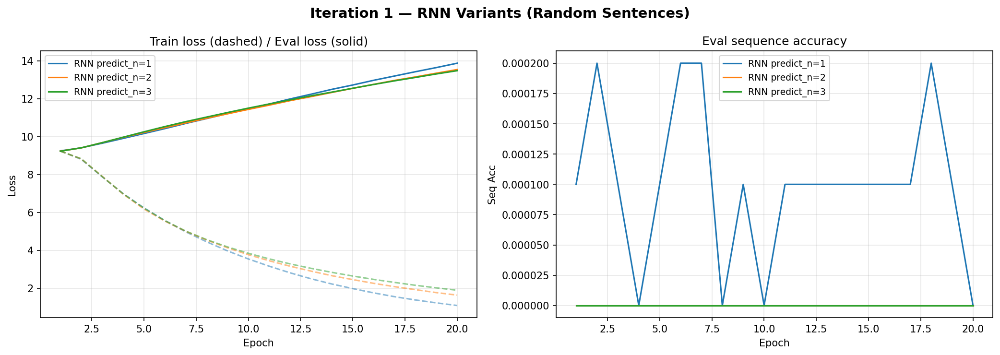
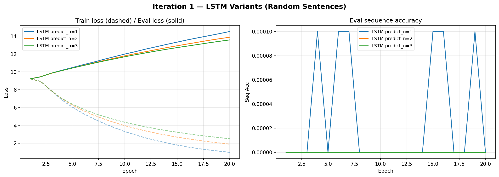
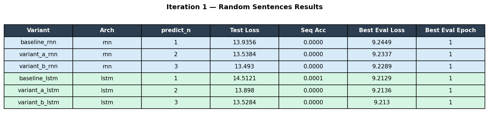
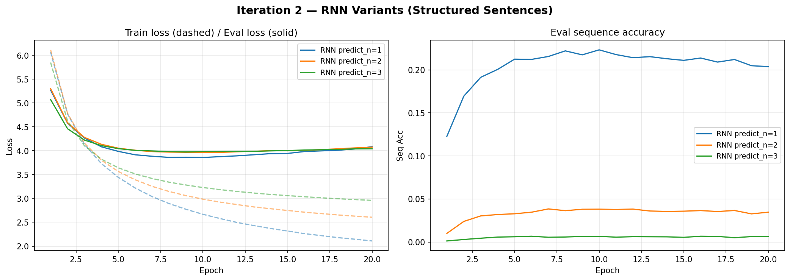
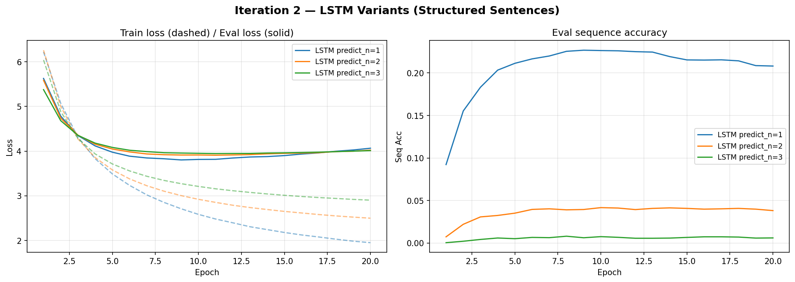
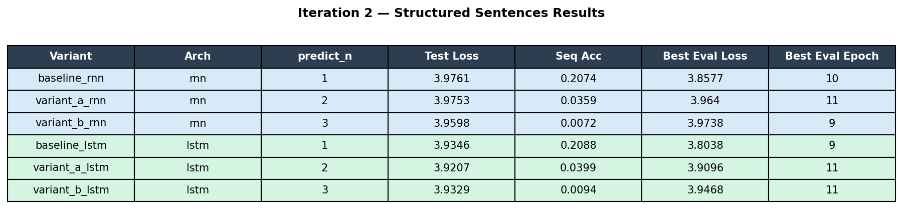
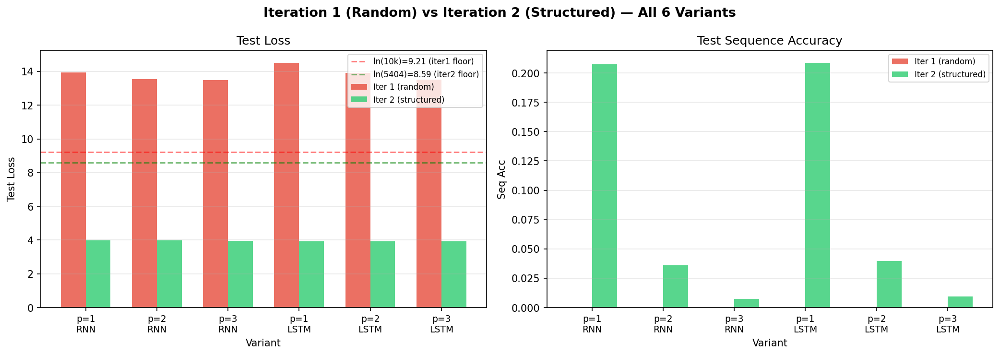

# L50_HomeWork — RNN vs LSTM Next-Word Prediction

Comparison study of Vanilla RNN and LSTM architectures across three prediction window sizes (1, 2, and 3 words) to measure how architecture type and output length interact on a next-word prediction task.

---

## Project Schema

```
Input sentence (first L-k words)
  └─► Embedding layer (128-dim)
        └─► RNN or LSTM (256 hidden units, 2 layers, dropout=0.3)
              └─► Final hidden state
                    └─► Linear head (256 → vocab_size × predict_n)
                          └─► Reshape → (predict_n, vocab_size) logits
                                └─► Cross-entropy loss vs last k target words
```

**6 experiment variants:**

| Variant ID       | Architecture | Predict N words |
|------------------|-------------|-----------------|
| `baseline_rnn`   | Vanilla RNN | 1               |
| `variant_a_rnn`  | Vanilla RNN | 2               |
| `variant_b_rnn`  | Vanilla RNN | 3               |
| `baseline_lstm`  | LSTM        | 1               |
| `variant_a_lstm` | LSTM        | 2               |
| `variant_b_lstm` | LSTM        | 3               |

---

## Data Flow

```
input/words.txt (10,000 unique words — read-only)
  │
  ▼
Dataset generator
  ├─ Builds 100,000 sentences of 5–6 words
  ├─ Deduplication check: if ≥ 0.05% duplicates → regenerate (up to 3 retries)
  └─ Split: 80% train / 10% test / 10% eval
       │
       ▼
  output/logs/dataset_stats.txt   ← generation log
       │
       ▼
Training loop (per variant)
  ├─ Per-epoch metrics → output/logs/{variant_id}.csv
  └─ Checkpoints every 5 epochs → output/checkpoints/{variant_id}/
       │
       ▼
Evaluation
  └─ Aggregated results → output/analysis/results_summary.csv
```

**Primary metric:** Per-token cross-entropy loss (fair across all 6 variants regardless of window size)  
**Secondary metric:** Exact-sequence accuracy

**Device selection:** Auto-detected at runtime — MPS (Apple Silicon) > CUDA > CPU.

**Reproducibility seeds (set in `config/config.yaml`):**
- `data_seed: 42` — controls dataset generation
- `model_seed: 99` — controls weight initialization and training

---

## Setup

### Prerequisites
- Python 3.10 or higher
- Git

### 1. Clone the repository
```bash
git clone <repo-url>
cd L50_HomeWork
```

### 2. Create and activate the virtual environment
```bash
python3 -m venv venv
source venv/bin/activate
```

### 3. Install dependencies
```bash
pip install -r requirements.txt
```

---

## How to Run

All experiments share the same entry point. Run one variant at a time.

### Run a single variant
```bash
python scripts/run_experiment.py --variant baseline_rnn
```

Replace `baseline_rnn` with any variant ID to run that experiment:

```bash
python scripts/run_experiment.py --variant variant_a_rnn
python scripts/run_experiment.py --variant variant_b_rnn
python scripts/run_experiment.py --variant baseline_lstm
python scripts/run_experiment.py --variant variant_a_lstm
python scripts/run_experiment.py --variant variant_b_lstm
```

### Run all 6 variants sequentially
```bash
for variant in baseline_rnn variant_a_rnn variant_b_rnn baseline_lstm variant_a_lstm variant_b_lstm; do
    python scripts/run_experiment.py --variant $variant
done
```

**After all runs complete**, the comparison table is written to:
```
output/analysis/results_summary.csv
```

---

## Configuration

All hyperparameters and paths are defined in `config/config.yaml`. Key settings:

| Parameter | Value | Description |
|-----------|-------|-------------|
| `num_sentences` | 100,000 | Total sentences generated |
| `embedding_dim` | 128 | Word embedding size |
| `hidden_size` | 256 | RNN/LSTM hidden units |
| `num_layers` | 2 | Stacked RNN/LSTM layers |
| `dropout` | 0.3 | Dropout probability |
| `epochs` | 20 | Training epochs per variant |
| `batch_size` | 256 | Training batch size |
| `learning_rate` | 0.001 | Adam optimizer LR |
| `grad_clip` | 1.0 | Gradient clipping threshold |
| `data_seed` | 42 | Dataset generation seed |
| `model_seed` | 99 | Model training seed |

---

## Experiment Iterations

This study is designed as a two-iteration controlled experiment. The only variable changed between iterations is the data: random vs. linguistically structured sentences. All model architectures, hyperparameters, and seeds remain identical across both iterations.

---

### Iteration 1 — Random Sentences (Complete)

**Data:** 100,000 sentences built by randomly sampling from 10,000 unique words with no linguistic structure. Sentences have no grammar, no co-occurrence patterns, and no learnable sequence signal.

#### Training Curves





#### Results



| Variant | Architecture | predict_n | Test Loss | Seq Acc | Best Eval Loss | Best Eval Epoch |
|---|---|---|---|---|---|---|
| baseline_rnn | Vanilla RNN | 1 | 13.94 | 0.0 | 9.24 | 1 |
| variant_a_rnn | Vanilla RNN | 2 | 13.54 | 0.0 | 9.23 | 1 |
| variant_b_rnn | Vanilla RNN | 3 | 13.49 | 0.0 | 9.23 | 1 |
| baseline_lstm | LSTM | 1 | 14.52 | ~0.0 | 9.21 | 1 |
| variant_a_lstm | LSTM | 2 | 13.91 | 0.0 | 9.21 | 1 |
| variant_b_lstm | LSTM | 3 | 13.52 | 0.0 | 9.21 | 1 |

Full archived results: `output/analysis/results_summary_iter1_random.csv`

#### Key Findings

- **Best eval loss for all 6 variants occurred at epoch 1** — models degraded after the first epoch, a clear sign of overfitting to noise rather than learning any pattern.
- **The ~9.21 eval loss floor equals `ln(10,000) ≈ 9.21`** — the theoretical random-chance baseline for a 10,000-word vocabulary. All variants converged at or above this floor, confirming that no model learned anything beyond uniform random guessing.
- **Sequence accuracy is 0 across the board** — expected when word sequences carry no structure. Predicting the next word is equivalent to a random draw.
- **LSTM vs. RNN difference is negligible** (9.21 vs. 9.23 best eval loss) — both architectures bottomed out at the same theoretical floor. Any apparent gap is noise, not signal.
- **Root cause:** Randomly sampled word sequences contain no learnable co-occurrence pattern. There is nothing for the model to learn. The data, not the architecture, is the binding constraint.

---

### Iteration 2 — Structured Sentences (Complete)

**Data:** 100,000 LLM-generated sentences with real English linguistic structure (5–6 words each), built from 5,404 unique words. Grammar, word co-occurrence, and syntactic patterns are present.

**Theoretical random-chance floor:** `ln(5,404) ≈ 8.59` (vocab = 5,404 unique words in dataset; training split sees 5,133)

#### Training Curves





#### Results



| Variant | Architecture | predict_n | Test Loss | Seq Acc | Best Eval Loss | Best Eval Epoch |
|---|---|---|---|---|---|---|
| baseline_rnn | Vanilla RNN | 1 | 3.976 | 0.2074 | 3.858 | 10 |
| variant_a_rnn | Vanilla RNN | 2 | 3.975 | 0.0359 | 3.964 | 11 |
| variant_b_rnn | Vanilla RNN | 3 | 3.960 | 0.0072 | 3.974 | 9 |
| baseline_lstm | LSTM | 1 | 3.935 | 0.2088 | 3.804 | 9 |
| variant_a_lstm | LSTM | 2 | 3.921 | 0.0399 | 3.910 | 11 |
| variant_b_lstm | LSTM | 3 | 3.933 | 0.0094 | 3.947 | 11 |

Full results: `output/analysis/results_summary.csv`

#### Key Findings

- **All 6 variants beat the random-chance floor of 8.59** — best eval losses of 3.80–3.97 confirm every model learned real structure from the data.
- **Best eval epoch shifted from epoch 1 to epochs 9–11** — models now genuinely train, unlike iter1 where everything degraded after epoch 1.
- **Sequence accuracy is non-zero** — predict_n=1 reaches ~20.7–20.9%, showing models correctly predict the next word 1 in 5 times. Accuracy drops sharply as window grows: predict_n=2 ~3.6–4.0%, predict_n=3 ~0.7–0.9%.
- **LSTM outperforms RNN on predict_n=1** — best eval loss 3.804 (LSTM) vs 3.858 (RNN). The LSTM's gating advantage is visible when predicting a single next word.
- **Per-token test loss is nearly flat across predict_n** — losses range only 3.92–3.98 across all six variants. Predicting more words at once does not dramatically hurt per-token quality.
- **Architecture gap is modest** — the real gap between iter1 and iter2 dwarfs any RNN vs. LSTM difference, confirming data structure is the dominant variable.

#### Cross-Iteration Comparison



---

## Conclusions and Observations

### Iteration 1 Conclusions

**The random-chance floor.** A model predicting uniformly at random over a vocabulary of size V will produce a cross-entropy loss of `ln(V)`. For this experiment's 10,000-word vocabulary, that floor is `ln(10,000) ≈ 9.21`. Every variant landed at this floor — meaning no model extracted any information from the training data. This is the expected outcome when the data contains no structure.

**RNNs and LSTMs are structure-dependent learners.** Both architectures rely on sequential patterns — repeated n-gram co-occurrences, syntactic dependencies, topic continuity — to reduce uncertainty about the next word. When those patterns are absent, gradient descent has no signal to follow. The models memorize nothing useful and generalize to nothing. Iteration 1 establishes this baseline condition with precision.

**Architecture choice is irrelevant when data is noise.** The LSTM's gating mechanisms (input, forget, output gates) are designed to selectively retain long-range dependencies. On random data, there are no dependencies to retain. The RNN and LSTM perform identically because the differentiating capability of LSTM — long-term memory — has no content to act on.

### Iteration 2 Conclusions

**Structured data is everything.** Every hypothesis was confirmed. All six variants converged well below the random-chance floor (best eval ~3.80–3.97 vs. floor ~8.59). The ~5-unit drop in loss from iter1 to iter2 is attributable entirely to the presence of learnable co-occurrence patterns in the data — all model hyperparameters and seeds were held constant.

**Sequence accuracy confirms real learning.** In iter1, sequence accuracy was exactly 0.0 for all variants. In iter2, predict_n=1 variants correctly predict the next word ~20.7–20.9% of the time. Even predict_n=3 (requiring all 3 target words to be correct simultaneously) achieves ~0.7–0.9%. This is non-trivial: a purely random model would score ~0.0%.

**Window size reduces sequence accuracy but not per-token loss.** Sequence accuracy falls sharply as predict_n grows (20% → 4% → 0.9%) because the joint probability of getting all k words correct compounds. Per-token loss, however, stays flat (3.92–3.98), meaning per-word prediction quality is stable regardless of window size.

**LSTM advantage is real but small on short sequences.** For predict_n=1, LSTM beats RNN (best eval 3.804 vs. 3.858). For predict_n=2 and 3, the gap closes — both architectures plateau similarly. At 5–6 word sentence lengths, the LSTM's long-range gating provides limited additional benefit.

**Summary table — Iter 1 vs Iter 2:**

| Variant | Iter 1 Test Loss | Iter 2 Test Loss | Iter 1 Seq Acc | Iter 2 Seq Acc | Best Eval Epoch (Iter1 → Iter2) |
|---|---|---|---|---|---|
| baseline_rnn (p=1) | 13.94 | **3.98** | 0.0 | **0.2074** | 1 → 10 |
| variant_a_rnn (p=2) | 13.54 | **3.98** | 0.0 | **0.0359** | 1 → 11 |
| variant_b_rnn (p=3) | 13.49 | **3.96** | 0.0 | **0.0072** | 1 → 9 |
| baseline_lstm (p=1) | 14.52 | **3.93** | ~0.0 | **0.2088** | 1 → 9 |
| variant_a_lstm (p=2) | 13.91 | **3.92** | 0.0 | **0.0399** | 1 → 11 |
| variant_b_lstm (p=3) | 13.52 | **3.93** | 0.0 | **0.0094** | 1 → 11 |

---

## Directory Structure

```
L50_HomeWork/
├── src/
│   ├── models/       # RNN and LSTM model definitions
│   ├── training/     # Training loop and optimizer setup
│   ├── evaluation/   # Metrics: cross-entropy loss, sequence accuracy
│   └── data/         # Dataset generation and DataLoader
├── config/
│   └── config.yaml   # All hyperparameters and paths
├── scripts/
│   └── run_experiment.py   # Entry point
├── input/
│   └── words.txt     # 10,000 unique words (read-only)
├── output/
│   ├── checkpoints/  # Per-variant model checkpoints (every 5 epochs)
│   ├── logs/         # Per-epoch CSV logs + dataset_stats.txt
│   └── analysis/     # results_summary.csv
├── screenshots/      # Result screenshots referenced in this README
├── tests/            # Validation and reproducibility tests
├── requirements.txt  # Pinned dependencies
└── README.md
```
